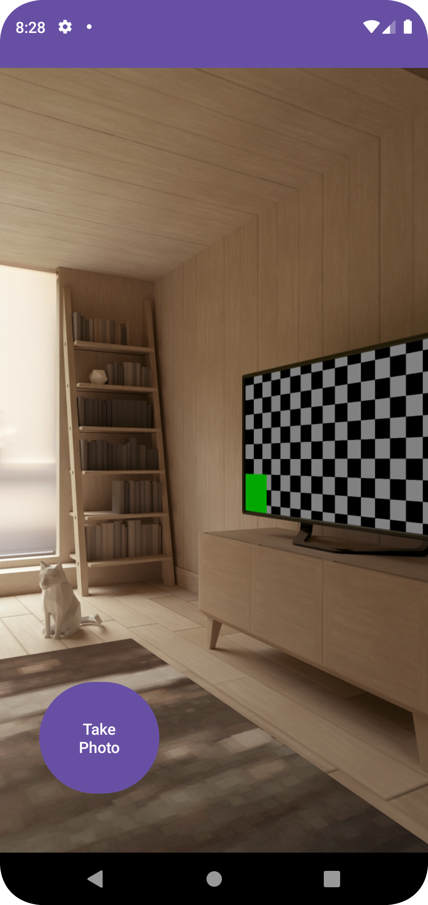
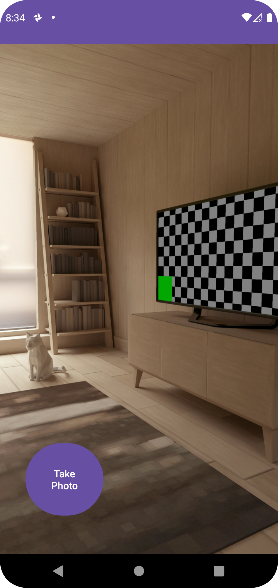
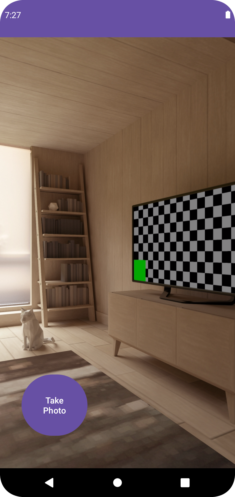

# overview
2023/7/19 現在、[1.3.0-alpha03](https://developer.android.com/jetpack/androidx/releases/camera?hl=ja#1.3.0-alpha03) 以降のcameraxバージョンをJavaプロジェクトで実行すると、<br>
ライブラリ側にkotlinのコードが混じっているのか以下のようにビルドエラーログが出る。<br>
```
Duplicate class kotlin.collections.jdk8.CollectionsJDK8Kt found in modules kotlin-stdlib-1.8.21
```
なので安定版の1.2.1か、1.3.0-alpha02を使う。<br>


# capture



