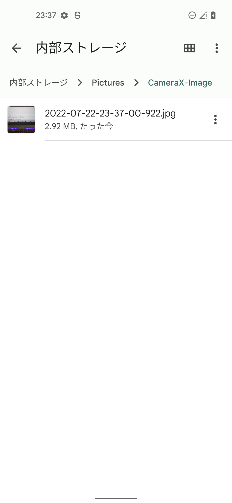
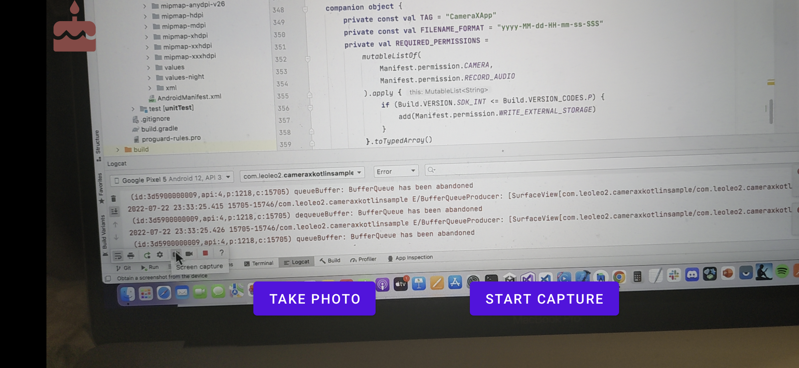

# Android Studioのバージョンについて

https://developer.android.com/reference/androidx/camera/video/Recorder?hl=ja
androidx.camera.videoパッケージの機能を使うには、cameraxライブラリのバージョンを1.1.0にしないといけない。

1.1.0にするとKotlinバージョン1.6.xに依存するため、 Android Studio 4.1 (Kotlin 1.4.31)は使えない。
Android Studio Arctic Fox 2020.3.1以上を使う必要がある。

# capture

